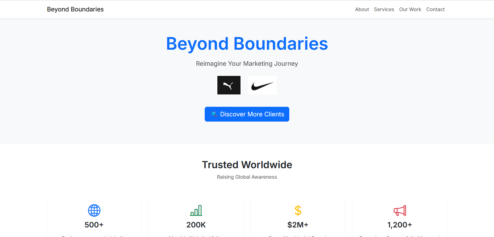
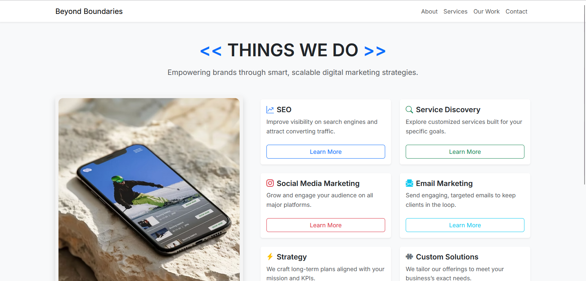

# 🌐 Beyond Boundaries - Capstone SEO Project

A collaborative digital marketing web application focused on SEO, service discovery, and business analytics. Built as part of a final capstone project to help businesses expand their reach through modern web technologies.

## 🚀 Live Demo
[Add your Netlify/Vercel/Firebase link here]

---

## 📌 Table of Contents
- [Features](#features)
- [Tech Stack](#tech-stack)
- [Getting Started](#getting-started)
- [Screenshots](#screenshots)

---

## ✅ Features

- 🔐 **User Authentication**
  - Register & login via Firebase Auth
  - Error handling on login
  - User profile update

- 📄 **Service Discovery**
  - View companies, descriptions, and links
  - Fetch company data from Firestore

- 📈 **SEO Dashboard**
  - Interactive graphs (Sales, Purchases, etc.)
  - Data-driven UI with chart libraries

- 📱 **Responsive Design**
  - Mobile-first layout using Bootstrap 5

---

## 🛠️ Tech Stack

- **Frontend**: React.js, Bootstrap 5
- **Backend/DB**: Firebase Firestore & Firebase Auth
- **Styling**: CSS3, Google Fonts (Inter)
- **Charts**: Chart.js or Recharts *(choose your implementation)*
- **Deployment**: [Netlify / Firebase Hosting]

---

## 🧰 Getting Started

### 1. Clone the Repo
```bash
git clone https://github.com/Abijith-Anil/capstone_seo.git
cd capstone_seo
````

### 2. Install Dependencies

```bash
npm install
```

### 3. Firebase Setup

* Create a Firebase project
* Enable Firestore and Authentication
* Replace the Firebase config in `/src/firebase.js` with your credentials

### 4. Run the App

```bash
npm start
```

## 📸 Screenshots

- 🏠 **Homepage**
  - 

- 🔐 **Services Page**
  - 